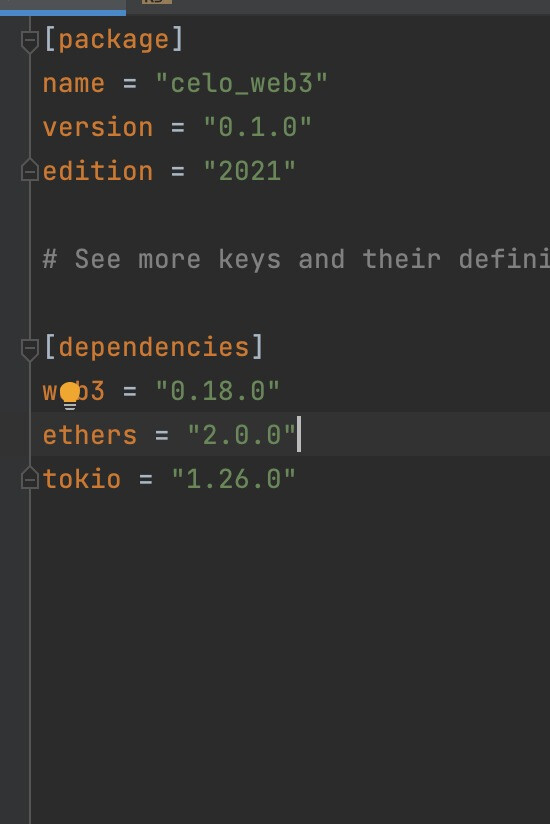
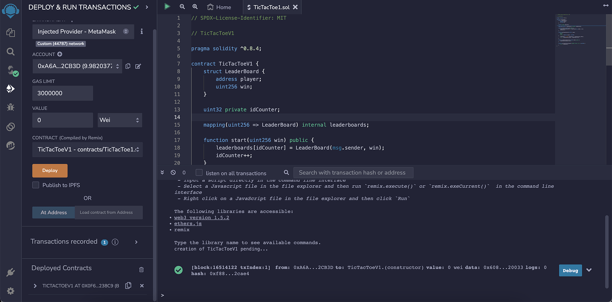
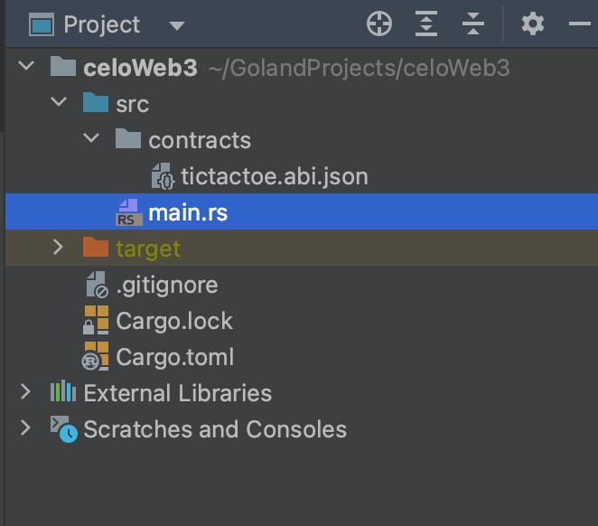
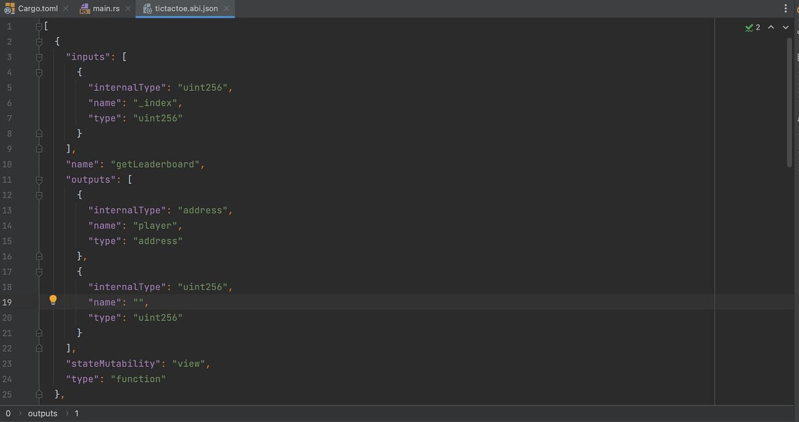
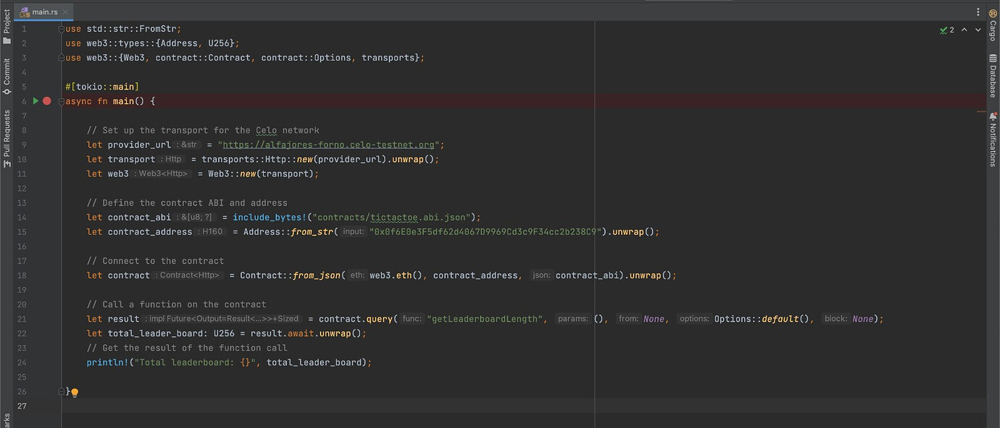
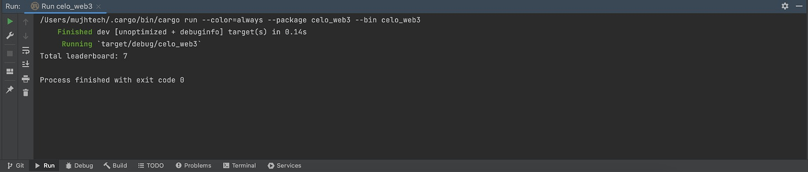

## Introduction

Blockchain technology has revolutionized the way we interact with digital assets and decentralized applications (DApps). Rust, a systems programming language known for its safety and efficiency, offers a compelling option for building blockchain applications. In this article, we will explore a Rust-based application that interacts with a smart contract deployed on the Celo blockchain network. Specifically, we will delve into the code snippet provided, which demonstrates how to connect to and query a Tic-Tac-Toe smart contract deployed on the Celo Testnet.

This tutorial will demonstrate how simple it is to interact with smart contracts, call functions, and listen to events in rust.

### How it works

Web3 Package is a pretty cool crate package that let you deploy, interact with any blockchain network.

## Prerequisites

Before we dive into the code, make sure you have the following components set up on your system:

Rust: Ensure you have Rust installed on your machine. You can get the latest version of Rust from the official website: https://www.rust-lang.org/

Celo Testnet Account: To interact with the Celo blockchain, you'll need a Celo Testnet account. You can create one through the Celo wallet or other compatible services.

Project Dependencies: For this project, we'll be using a few interesting dependencies to interact with the Celo blockchain.

- [tokio](https://crates.io/crates/tokio): Tokio is a popular asynchronous runtime for Rust, designed to help developers build efficient and scalable applications with asynchronous I/O. It enables writing non-blocking, concurrent code that can handle many I/O operations efficiently without being blocked by waiting for them to complete.
- [web3](https://crates.io/crates/web3):  Ethereum JSON-RPC multi-transport client. Rust implementation of Web3.js library.
- [ethers](https://crates.io/crates/ethers):  allows developers to interact with the Ethereum blockchain, handle Ethereum transactions, interact with smart contracts, and manage Ethereum accounts and keys.



## Getting Started

I assume anyone going through this tutorial already understands and uses Rust, so I will skip the setup involved in getting Rust to work on your development computer. That means I assume you already have VS Code/Intellij Idea/Eclipse/Atom and Rust setup on your PC.

If you are entirely new to Rust, here ( [https://www.rust-lang.org/learn/get-started](https://www.rust-lang.org/learn/get-started) ) is a good tutorial you can learn from or make use of online rust playground ([https://play.rust-lang.org/](https://play.rust-lang.org/)).

## Setup the Smart Contract

The next step is to compile our smart contract using the solidity compiler of your choice, such as hardhat, truffle, or any other solidity compiler.

```solidity
// SPDX-License-Identifier: MIT

// TicTacToeV1

pragma solidity ^0.8.4;

contract TicTacToeV1 {
    struct LeaderBoard {
        address player;
        uint256 win;
    }

    uint32 private idCounter;

    mapping(uint256 => LeaderBoard) internal leaderboards;

    function start(uint256 win) public {
        leaderboards[idCounter] = LeaderBoard(msg.sender, win);
        idCounter++;
    }

    function getLeaderboard(uint256 _index)
        public
        view
        returns (address player, uint256)
    {
        LeaderBoard storage leaderboard = leaderboards[_index];
        return (leaderboard.player, leaderboard.win);
    }

    function updateLeaderboard(uint256 index) public {
        leaderboards[index].win++;
    }

    function getLeaderboardLength() public view returns (uint256) {
        return (idCounter);
    }
}
```

### Understand the smart contract

The given smart contract, called `TicTacToeV1`, is a simple implementation that maintains a leaderboard to keep track of players' wins in a Tic-Tac-Toe game. This contract is written in Solidity, the programming language used for creating smart contracts on the Ethereum blockchain. Let's go through each part of the contract to understand its functionality:

- SPDX License Identifier

```solidity
// SPDX-License-Identifier: MIT
```

The SPDX license identifier is a standard way to specify the license under which the smart contract is distributed. In this case, the contract is licensed under the MIT license.

- Contract Definition
```solidity
pragma solidity ^0.8.4;

contract TicTacToeV1 {
```

The contract is defined using the `contract` keyword followed by the contract name, `TicTacToeV1`. The `pragma solidity ^0.8.4;` statement specifies the version of the Solidity compiler required to compile the contract.

- LeaderBoard Struct

```solidity
struct LeaderBoard {
    address player;
    uint256 win;
}
```

The contract defines a struct called `LeaderBoard`, which stores information about players on the leaderboard. Each entry in the leaderboard will contain the player's address (`player`) and the number of wins (`win`).

- State Variables

```solidity
    uint32 private idCounter;
    mapping(uint256 => LeaderBoard) internal leaderboards;
```

- ``idCounter``: This is a private state variable of type `uint32`, used to keep track of the unique IDs for each entry in the leaderboard.
- ``leaderboards``: This is a mapping that associates an `uint256` index with a `LeaderBoard` struct. It is used to store the player's data at a specific index in the leaderboard.

- start Function
```solidity
    function start(uint256 win) public {
       leaderboards[idCounter] = LeaderBoard(msg.sender, win);
       idCounter++;
    }
```

The `start` function allows a player to start a new game and add themselves to the leaderboard. It takes a `win` parameter, representing the number of wins the player has achieved. The function creates a new entry in the leaderboard, associating the player's address (sender) with the given number of wins. The `idCounter` is incremented to maintain the uniqueness of the entries.

- getLeaderboard Function

```solidity
   function getLeaderboard(uint256 _index) public view returns (address player, uint256) {
       LeaderBoard storage leaderboard = leaderboards[_index];
       return (leaderboard.player, leaderboard.win);
   }
```

The `getLeaderboard` function allows anyone to view the information of a player at a specific index in the leaderboard. It takes the `_index` as an argument and returns the player's address (`player`) and the number of wins (`win`) associated with that index.

- updateLeaderboard Function

```solidity
   function updateLeaderboard(uint256 index) public {
       leaderboards[index].win++;
   }
```

The `updateLeaderboard` function is used to update the number of wins for a player at a specific index in the leaderboard. It takes the `index` of the player to be updated and increments their win count by one.

- getLeaderboardLength Function

```solidity
   function getLeaderboardLength() public view returns (uint256) {
       return (idCounter);
   }
```

The `getLeaderboardLength` function returns the total number of entries in the leaderboard. It simply returns the value of the `idCounter`, which represents the number of players on the leaderboard.

### Conclusion

The `TicTacToeV1` smart contract demonstrates a basic implementation of a leaderboard for a Tic-Tac-Toe game. Players can start a game, and their wins are recorded and updated on the leaderboard. The contract allows anyone to view the leaderboard's content and the total number of players on the leaderboard.

Keep in mind that this contract does not implement the actual logic for playing Tic-Tac-Toe; it solely focuses on the management of the leaderboard. To have a fully functional game, you would need to integrate this contract with the game's logic, including the rules for playing and determining the winner.

### Deploy Smart contract (Remix)

Remix provides an integrated Solidity compiler. Click on the "Solidity Compiler" tab in the left-hand sidebar, and select the correct compiler version for your contract. Then, click on the "Compile" button to compile your smart contract code. Make sure there are no compilation errors.

Now that your contract is compiled, you can deploy your smart contract to the network. You can deploy to any Ethereum-compatible network, and in this case, we’ll be deploying the Celo Testnet or Mainnnet depending on your preference. If you’re new to this stick with Testnet!

- Click the Deploy and Run Transactions Icon on the left side menu.
- Choose Injected Web3 as your environment.
- [Connect MetaMask to Celo](https://medium.com/@Celo_Academy/3-simple-steps-to-connect-your-metamask-wallet-to-celo-732d4a139587) testnet and verify the network. After connecting your wallet, you should see a "Deploy" section in the Remix editor. Ensure that your selected contract is the one you want to deploy. Click on the "Deploy" button to initiate the deployment process.
- Confirm Transaction: Depending on the wallet you're using, you may need to confirm the transaction to deploy the smart contract. Follow the prompts on your wallet interface to confirm the deployment.
- Wait for Deployment: The deployment process may take a few moments, especially if you're using a testnet with longer block times. You can monitor the transaction status on your wallet or the Remix interface.
- Get Contract Address: Once the deployment is successful, you'll receive the transaction receipt, which includes the contract address. This address represents the location of your smart contract on the Ethereum blockchain.



## Rust Implementation

### Directory structure



Let’s copy our Contract ABIs into our project.

Then create a folder in the project folder directory lib and create a file named tictactoev1.abi.json.



```javascript
[
  {
    inputs: [
      {
        internalType: "uint256",
        name: "_index",
        type: "uint256",
      },
    ],
    name: "getLeaderboard",
    outputs: [
      {
        internalType: "address",
        name: "player",
        type: "address",
      },
      {
        internalType: "uint256",
        name: "",
        type: "uint256",
      },
    ],
    stateMutability: "view",
    type: "function",
  },
  {
    inputs: [],
    name: "getLeaderboardLength",
    outputs: [
      {
        internalType: "uint256",
        name: "",
        type: "uint256",
      },
    ],
    stateMutability: "view",
    type: "function",
  },
  {
    inputs: [
      {
        internalType: "uint256",
        name: "win",
        type: "uint256",
      },
    ],
    name: "start",
    outputs: [],
    stateMutability: "nonpayable",
    type: "function",
  },
  {
    inputs: [
      {
        internalType: "uint256",
        name: "index",
        type: "uint256",
      },
    ],
    name: "updateLeaderboard",
    outputs: [],
    stateMutability: "nonpayable",
    type: "function",
  },
];
```

### Rust Implementation



```rust
use std::str::FromStr;
use web3::types::{Address, U256};
use web3::{Web3, contract::Contract, contract::Options, transports};

#[tokio::main]
async fn main() {

    // Set up the transport for the Celo network
    let provider_url = "https://alfajores-forno.celo-testnet.org";
    let transport = transports::Http::new(provider_url).unwrap();
    let web3 = Web3::new(transport);

    // Define the contract ABI and address
    let contract_abi = include_bytes!("contracts/tictactoe.abi.json");
    let contract_address = Address::from_str("0x0f6E0e3F5df62d4067D9969Cd3c9F34cc2b238C9").unwrap();

    // Connect to the contract
    let contract = Contract::from_json(web3.eth(), contract_address, contract_abi).unwrap();

    // Call a function on the contract
    let result = contract.query("getLeaderboardLength", (), None, Options::default(), None);
    let total_leader_board: U256 = result.await.unwrap();
    // Get the result of the function call
    println!("Total leaderboard: {}", total_leader_board);

}
```

## Understanding the Code

The provided code showcases how to interact with a smart contract deployed on the Celo blockchain using the Rust programming language. Let's break down the code step by step:

- Importing Necessary Modules

```rust
use std::str::FromStr;
use web3::types::{Address, U256};
use web3::{Web3, contract::Contract, contract::Options, transports};
```
Here, we import the required modules from the web3 crate, which provides the necessary functionality to interact with the Celo blockchain.

- Setting up the Transport

```rust
let provider_url = "https://alfajores-forno.celo-testnet.org";
let transport = transports::Http::new(provider_url).unwrap();
let web3 = Web3::new(transport);
```
In this section, we define the URL of the Celo testnet we want to connect to and create an HTTP transport instance for the web3 library to interact with the blockchain.

- Defining the Contract ABI and Address
```rust
let contract_abi = include_bytes!("contracts/tictactoe.abi.json");
let contract_address = Address::from_str("0x0f6E0e3F5df62d4067D9969Cd3c9F34cc2b238C9").unwrap();
```
Here, we specify the contract's Application Binary Interface (ABI) and its address on the Celo network. The ABI is a JSON representation of the contract's functions and data structures, enabling easy communication with the contract.

- Connecting to the Contract

```rust
let contract = Contract::from_json(web3.eth(), contract_address, contract_abi).unwrap();
Using the web3 library, we create an instance of the Contract struct that represents the Tic-Tac-Toe smart contract.
```

- Querying a Function on the Contract

```rust
let result = contract.query("getLeaderboardLength", (), None, Options::default(), None);
let total_leader_board: U256 = result.await.unwrap();
```

In this part of the code, we query the getLeaderboardLength function on the Tic-Tac-Toe contract. This function returns the length of the leaderboard, which tracks the scores of players in the game. The contract.query method takes the function name, its input parameters (in this case, there are none), and additional options for the query.

- Displaying the Result

```rust
println!("Total leaderboard: {}", total_leader_board);
```

Finally, we print the result obtained from the getLeaderboardLength function, which represents the total number of entries in the leaderboard.

- Running the Application

Before running the application, ensure that you have the correct contract ABI and address in the code, and you'll need to replace the **_contracts/tictactoe.abi.json_** and **_contract_address_** values with the actual ABI and address of the smart contract you want to interact with. Additionally, make sure that you have a working internet connection. You can generate the ABI using a tool like Abigen or Solc, and you can get the contract address from a blockchain explorer or by deploying the contract yourself.

To run the application, execute the following command in your terminal:

```bash
cargo run --color=always --package celo_web3 --bin celo_web3
```




In this example, we first set up a transport for the celo network using the transport Http struct method from web3. We then create a new web3 instance from the http transport we created. We then define the ABI and address of the smart contract we want to interact with. We use the Contract struct from web3 to connect to the contract, and then call a function on the contract using the query/call method. Finally, we get the result of the function call and print it out.

## About the Author

I am a Software Engineer, Tech Evangelist (Preaching the gospel of flutter & blockchain) also and Ex-GDSC Leads.

## References

- [Github Repo](https://github.com/Mujhtech/rust_web3)
- [Tokio crate package](https://crates.io/crates/tokio)
- [web3 crate package](https://crates.io/crates/web3)
- [Get started with rust](https://www.rust-lang.org/learn/get-started)
- [Learn solidity by example](https://solidity-by-example.org)
